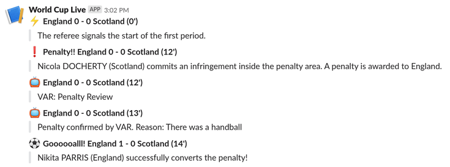

# NAME

world-cup-slack 0.04

# DESCRIPTION

Downloads World Cup live game events from FIFA API & posts to Slack.

Run following command to install dependencies.

    cpanm File::Slurper Furl Getopt::Long List::Util JSON::XS

Script comes with a debug mode, where you can pass a timeline.json and
it prints messages to screen. Debug mode requires one time download of
calendar to get team names.

You can set a cronjob to run at every minute to utilize this script.

# SYNOPSIS

First, you will need a Slack incoming webhook URL. Here's how to get it:

- Create an app at [https://api.slack.com/apps?new\_app=1](https://api.slack.com/apps?new_app=1)
- Go to your app details page at [https://api.slack.com](https://api.slack.com)
- Go to "Incoming webhooks" on left navigation, it will be there.

Post to slack incoming webhook URL.

    perl world-cup-slack.pl --slack=https://hooks.slack.com/services/...

Process an existing JSON file for debug

    perl world-cup-slack.pl --debug=12345678.json

Increase politeness sleep (defaults to 2 seconds)

    perl world-cup-slack.pl --slack=... --sleep=10

Specify multiple Slack URLs to post to multiple workspaces

    perl world-cup-slack.pl --slack=... --slack=...

Specify name and location of db.json file. This may be
helpful if you are running multiple instances of script.

    perl world-cup-slack.pl --slack=... --dbjson=/some/file.json

Testing by posting to Slack is also possible. Use following instructions.

- Remove your db.json file.
- Run script once with --slack argument provided.
- Go into db.json and manually update one of the "status:0" games to "status:3"
- Run script second time, it will collect events and keep them with "posted:0"
- Run script for third time. It will post all events at once.

# LICENSE

MIT.

# ATTRIBUTION

This script is partly based on
[j0k3r/worldcup-slack-bot](https://github.com/j0k3r/worldcup-slack-bot)
which was written in PHP.
